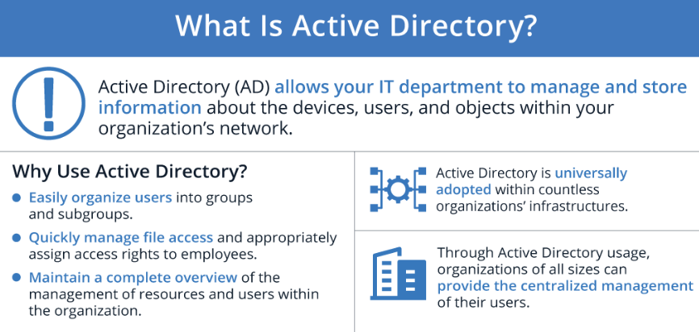

# Active directory

Active Directory (AD) on Microsoft:in Windows toimialueen käyttäjätietokanta ja hakemistopalvelu, joka hallitaan verkon käyttäjiä, tietokoneita ja eri resurssei. Myös mahdollistaa keskitetyihin resurssien jakamista käyttäjille, ryhmille ja sovelluksille, sekä tarjoo myös tavan nimeä, kuvata, paikallista, hallita ja suojaa verkon resurssia.

AD rakentuu nykyään LDAP (Lightweight Directory Access Protocol)- ja Kerberos-protokollille. Myös mukana on Microsoft pilvipohjainen Azure AD-palvelu, mitä tarjoaa kattavan <b> Identity and access management (IAM) </b> -  ratkaisua yritykselle/organisaatiolle, jotka haluavat hallita paikallisia ja pilvipohjaisia resurssia.

AD palvelu tallentaa tietoja käyttäjistä, laitteista, sovelluksista, ryhmistä ja laitteista hierarkkiseen rakenteeseen. Tietojen rakenne mahdollistaa verkkoon kytkettyjen resurssien yksityiskohtien löytämisen yhdestä paikasta. Pohjimiltaan Active Directory toimii kuin puhelinluettelo verkossa, joten voi etsiä ja hallita laitteita helposti, myös useiteiden laitteiden hallinta menee nopeammin ilman, että ylläpitäjä ei tarvitse tilitietoja päästäkseen jokaiselle koneelle.

* [AD three tiers](#AD-three-tiers)
    * [storage architecture](#storage-architecture)
- 
- [AD monipuolisia harjoituksia](#AD-monipuolisia-harjoituksia)
- 

## AD three tiers

<b>Domains, tress & forests </b>  

Nämä termit viittaavat AD:n sisäisen loogisen rakenteeseen. Puu (tree) joka on yksi toimialue tai objektiryhmä, joka seuraavat alialueet (child domainit). Metsä (forest) on ryhmän toimialue (domain group), jotka koostuu yhteen ja kun on useita puita (tree) nii ryhmittyvät yhteen niin muodostuu metsä (forest). Esim. objektista voi olla käyttäjä tai laiteisto (työasema, tulostin ja jne), jotka käyttävät samaa tietokantaa, ja ryhmiytyvät yhdeksi domainiksi. Kun on useita domaineita josta yhdistettään ryhmiksi ja sitä myös kutsutaan puuksi (tree).

Metsän <b> puut </b> ovat yhdeyssä toisiinsa luottamussuhteen kautta, mikä mahdollistaa tietojen jakamista eri toimialueelle. Kaikki domainit (verkkotunnukset) luottavat toisiinsa automaattisesti, joten voi käyttää samoilla tilitiedoilla, jotka ovat käytetty root domain:iin (juuri verkkotunnus). 

Esim. verkon ylläpitäjä (network administrator) on valittava <b> yksittäinen metsä suunnitelma </b> tai <b> useaman metsä suunnitelman</b> välillä. Yhden metsän suunnittelu on yksinkertainen, koska halpa ja helppo hallita, ja sillä kun yksi metsä käsittelee koko verkon. Myös vastakohtana useita metsä suunnitelmissa jakaa verkon eri metsiin, mikä on hyvä turvallisuuden kokoonpano kannalta, mutta monitmukaisempi hallinto.

### storage architecture

Domainista, puu (tree) ja mestästä (forest), että on lisäksi AD:n tallennusarkkitehtuurien on kolme lisää osaa, jotka ovat <b>DNS, schema & datastore</b>.

- DNS : "domain name server" , mikä toimialue ohjaimen sijainti nimienselvityspalvelua (domain controller location). Kun käyttäjä navigoi verkkosivua 

- Schema :

- Datastore :

# AD monipuolisia harjoituksia

active directory:ssä on jotakin hyviä harjoituksia, mitä voi tukea työpaikassa, koulutuksessa tai muualla käyttöön niin niistä voi olla hyötyä tulevaisuudessa

