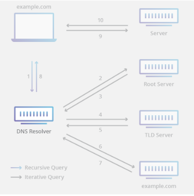
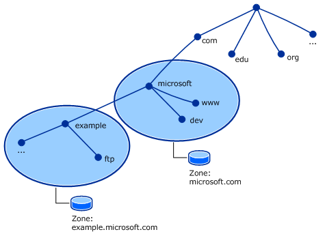
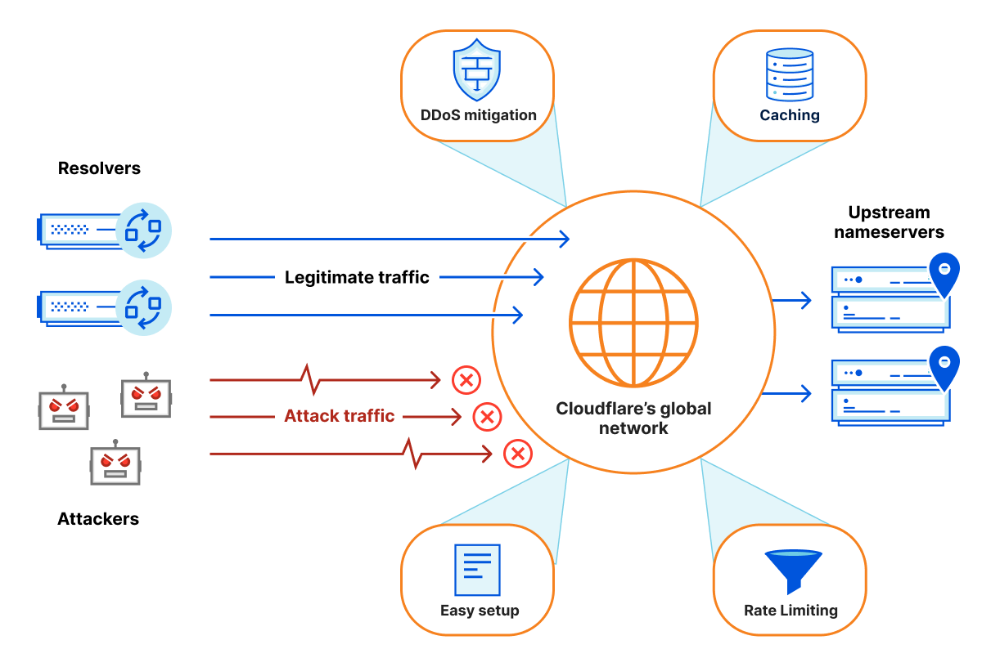

# Cloudflare

Cloudflare, Inc. on yhdysvaltalainen yritys, joka tarjoaa sisällönjakeluverkkoa, DDoS-suojausta ja muita pilvipalvelua. Verkkosivusto, joka on otettu käyttöön, ei itse jaa sisältöään, vaan Cloudflare toimii sille käänteisenä välityspalvelimena.

Cloudfrale toimii kuin välittäjänä asiakkaan ja palvelimen välillä käyttämällä käänteisellä välityspalvelinta verkkosivustojen peilausta ja välimuistia. Sen tarkoituksena on vähentää latenssia, kaistanleveyttä ja sivuston latausaikaa, kun käyttäjät vierailevat verkkosivua. Cloudflare tarjoaa suuria DNS (doman name system)- ja julkisia DNS-selvityspalveluita. Molempia tarjotaan yksityisyyden ja nopeuden ensisijaisina vaihtoehtoina Internet-palveluntarjoajan DNS-palvelimille. Esim. jos käy haku sivustolla 1.1.1.1 palveluun, joka tukee minkä tahansa laitteen.

Cloudfrale tarjoaa myös DDoS-suojausta, sähköpostien lajittelua, verkkosovellusten palomuuria ja uhkien estämistä. 

* [Domain servers](#Domain-servers)
* [DNS servers](#DNS-servers)
* [DNS zone](#DNS-zone)
* [dns palomuuri](#dns-palomuuri)
* [Nameserver](#Nameserver)
* [Proxy status](#Proxy-status)
* [muita ohjeita](#muita-ohjeita)

## Domain nimi

Yleinen domain luonti / muokkaus muu vastaava uusi recordin luonti. Luonti <ins>record:ien</ins> kanssa tapahtuu, että organisaatiossa luodaan tai lisätään jonkinlainen laite yhteys, tai lataa webbi sivuston, että käyttäjä muistaa sen ja hyödyntää kirjamalla IP-osoitetta. Käyttäjän Webbi sivustot suorittaa automaattisen lähettyksen kyselyn DNS-resolver:iin.

<b> Type </b> - tarkoittaa valittaan tietty tyyppi usein valitaan joko A record = mikä määrittää IPV4 (ip-osoitetta esim. 10.32.182.9) tai AAAA record = ipv6 (esim.52:74:f2:ff:fe:b1:a8:7f) tai CNAME = tarkoittaa nimitietue/domain nimi tai tunnusnimi esim. (foo.example.net)

<b>Name - </b> - tähän valikkoon pitää olla tarkanna, että onko kyseessä tulossa jokin domain/verkkotunnus nimi tai host - verkko isäntä nimi & tähän valikkoon pitäisi tulla tietty <ins> nimi </ins>

<b>IPV4</b> - tämän valikko ensimmäisenä saattaa tulla mieleen IP-osoite (esim. 10.94.240.254), mikä on periaatteessa oikea vaihtoehto, mutta mikäli jos on erillinen special <ins>vaadittu data</ins>, joten siihen tulee special nimetys tai muu <ins>arvo</ins>

<b>TTL</b> - lyh. time to live , tarkoittaa datan elinaika, että  kuinka usein pitää päivittää, tai käytetään kuvaamaan jonkin verkon yli lähetettävän tai muun datan elinaikaa. Usein oletuksena valittaan automaatinen (auto). Esim. jos valitsee tietyn luvun n. 14 400 sekuntia (4h), mitä tarkoittaa A record:i tulee päivittämään seuraavan 240 minuuttin päästä eli 4h päästä.

<b>Proxy status </b> - Proxy status jos on oranssi pilvi eli <b> (enabled)</b>, tarkoittaa liikenne tapahtuu, että verkkoliikenne kulkeutuu Cloudflare järjestelmän kautta ja jos on harmaa pilvi <b>(disabled) </b> niin ei kulje Cloudflare järjestelmään. <ins> Oranssi pilvi </ins> tarkoittaa sen verkkotunnus/sivun nopeus oivallus, että jos on esim. Uutinen & Sekä <ins> harmaa pilvi </ins> tarkoittaa liikenne kulkeutuu suoraan yrityksen  serveriin (palvelimeen), mutta sen tietojen mukaan ei ole cloudflare välityspalvelinta ja  yrityksen tiedot kulkeutuu salattuna jos on esim. Salaisia  dokumenttia/tiedostoja/yksityis keskustellua ja jne. 

## DNS servers

Verkkokäyttöiset sovellukset, kuten selaimet, käyttävät jotain nimeltä Stub Resolver vuorovaikutuksessa DNS:n kanssa. Kun sovellus tai selain on saanut verkkosivuston IP-osoitteen, he voivat käyttää sitä HTTP- tai HTTPS-protokollien avulla.

DNS:llä on neljä tyyppistä kategoria nimipalvelimia (nameserver), josta ovat <b>DNS oma ratkaiseja </b> (resolver) <b> root:in </b>, <b> TDL:n </b> (top-level domain) ja <b> virallinen </b>(authoritative) nimipalvelimet.  Nämä neljä tyyppiset kategoriat toimivat yhdessä harmoniassa suorittakseen tehtävän toiminnan määritettyihin toimialueen IP-osoitteen käyttäjäille/asiakkaalle.

DNS:än A-recordi käytetään myös DNSBL (domain name system based blackhole) suom. musta lista käyttämiseen. Musta lista käytettään parhaiten roskapostien suodattamiseen, että lajittelee sähköpostipalvelimiien tunnistamista ja estää tuntematomia sähköpostiaviestejä eli roskapostit.

## DNS zone

DNS *alue* tai *vyöhykke*, joka on DNS:än erityinen alue ja tätä hallinnoi yleensä organisaation itsensä tai ylläpitäjä rooli itsensä. DNS toiminnaltaan on ajettu useisiin eri alueisiin, jotka ovat sisäisen hallitujen DNS-nimitilassa (namespace). DNS alueaalla sisältää useita **aliverkkotunnuksia** (subdomain) *(esim. bloggi.sivusto.com)* tai alemman kuvan mukaan esim. *zone.microsoft.com* hierarkki puu näköinen haarukka. DNS-alue alkaa puussa olevasta toimialueesta, ja voi myös ulottua aliverkkotunnuksiin, jotta yksi entiteetti voi hallita useita aliverkkotunnuksia.

Kaikki alueen tiedot tallennetaan, josta kutsuttuun DNS-alue tiedostoksi (DNS zone file), jossa on avain DNS-alueen toiminnan operaattorit. Alueiden tiedoston DNS - palvelin (server) tallennettujen tekstitiedosto, jonka sisältää alueen todellisuuden kuvaus ja sisältää kaikki tietuen (record) alueen toimialue.Alue tiedosto  pitää tulla aina alkaa SOA (start of authority) record:ista, ja sisältää tärkeitä tietoja ja mukaan lukien  alue ylläpitäjän yhteystiedot.

## DNS palomuuri

Cloudflare:n dns palomuuri välittää kaikkiin DNS kyselyihin nimipalveluihin, josta cloudflare globaalin reunaverkon kautta (global edge network). Toiminnassa se suojaa ylävirran (upstream) nimipalvelun, josta DDoS-hyökkäystä ja vähentää kuormitusta tallentamall DNS-vastausta välimuistiinsa.

DNS-palomuuri on tarkoitettu asiakkaille, joiden on nopeutettava ja suojattava  kokonaisia arvovaltaisia nimipalvelimia (authoritative nameservers), ja suorittaa täys tai osittaisen auktorisointia/arvovaltaisen/standardin DNS:n asiakkaille, jolloin on nopeuttava ja suojattava yksittäisiä vyöhykkeitä.

Myös etuja DNS-palomuurissa on organisaatiot voivat hallita täysin arvovaltaisia nimipalvelimia: DDos lieventämistä, korkea saatavuus, globaali jakelua, parannettujen suorituskykyä, kaistanleveyden säästöä, dns-välimuistia, määrittää pien ja suuren TTL ja jne.

## Nameserver

Suom. *nimipalvelin*, joka viittaa DNS komponentiin, että tärkeä osuus nimitiloissa (namespace) ja Internetissä. Tärkein tehtävänä se on DNS-palvelimen kuin käännös joka tukee <b> domain nimit (verkkotunnus esim. sivusto.fi) </b> ja <b> host/isäntä </b> IP-osoitteen (93.47.123.4), toisena päänimeä tilaa Internetin, joka  käytetään tietokonejärjestelmien ja -resurssien tunnistamista japaikantamista Internetissä. 

Periaatteessa nimipalvelin (nameserver) viittaa DNS:ään (Domain name system), ja sitä voi käyttää myös kaikissa tietokoneohjelmissa, jotka toteuttavat verkkopalvelun (network service)  ja niitä voi vastata hakemistonpalvelua (directory service) ja kääntää usein  inhimilliseen merkitykselliseen tekstiin.

DNS nimipalvelin esim. & record type voi olla esim. CNAME 
| example.com | record type: | value : | TTL | 
| ---------- | ---------- | ------------- | -----------| 
| @ | nameserver | nameserver1.example.com | AUTO | 
| @ | nameserver | nameserver2.example.com | AUTO | 

Domain eli verkkotunnuksessa on useita nimipalvelin tukea, jotka voivat osoittaa kyseisen toimialueen ensimmäisen ja toisen sijaisen nimipalvelimen. Ilman asiallista konfigurointia/määritystä nimipalvelin tietukea käyttäjät eivät voi ladata verkkosivua tai sovellusta.

Nimipalvelimien päivitystä tai vaihtoa suorittaa ylläpitäjät/järjestelmänvalvoja. Esim. pilvipalvelutarjoajat tarjoavat nimipalvelinta ja vaatii asiakkaan/käyttäjän osoittamaan niitä. Ylläpitäjä saattaa haluta myös päivittää nimipalvelimien record:in jos haluavat aliverkkotunnuksen (subdomain) käyttävän eri nimipalvelimia (nameserver). 

Ylläpitäjä saattaa suunnittella päivitystä nimipalvelu record:lle, niin saattavat haluta k

## Proxy status

Organisaatiolla on aina oma työkalu väline, jossa suoriuttuu joko kommunikointi/viestintä tai muu tärkeä väline kuten selaimien chätti kanava, bloggit, dokumenttien säilytys tai muu sovellus, että näillä on tärkeät dokumentit/infot.  

<b> Proxy status </b> tarkoittaa liikenteen osoitteenmuutosta, josta julkisesti liikenöityy <b> IP-osoite </b> joko <ins> yksittyisellä </ins> tai <ins> julkisella </ins> osoitteella. Cloudflare käsittelee tietuen tulevia liikenteitä, että ottaa käyttöön palvelimille A, AAAA ja CNAME tietuet. 

DNS proxied (oranssi pilvi päällä) tarkoittaa, että näytettään Cloudflare IP-osoiteta A.B.C.D & Näin joten pitäisi kulkea Cloudflare järjestelmän lävitse, mitä tekee sivustosta nopeamman, turvallisemman ja älykkäämän. Sitä käytettään parhaiten subdomain eli aliverkkontunnuksien / alidomainta (testi.domain.fi)

Harmaa pilvi eli DNS Only tarkoittaa ei kulje Cloudflare:n ylitse, mitä eroaa pilvi päällä vai ei? Sitä käytettään jotka liittyy muuta kuin verkkoliikennettä kuten organisaatio yksityiset salaiset asiat / dokumentointi mm. sähköposti, ftp, ja ssh, eli tietoliikenneverkon protokollat ja muut salaiset käyttöön ottot. FTP - file transfer protocol.

## muita ohjeita:

DNS serveri tyyppit (4kpl):  
https://www.cloudflare.com/learning/dns/dns-server-types/  
https://blog.cloudflare.com/cloudflare-dns-is-simple-fast-and-flexible/   

Perus cloudflare dns recordien ja muu domain luonti (tyhjästä alkaen):  
https://www.namecheap.com/support/knowledgebase/article.aspx/9607/2210/how-to-set-up-dns-records-for-your-domain-in-cloudflare-account/

