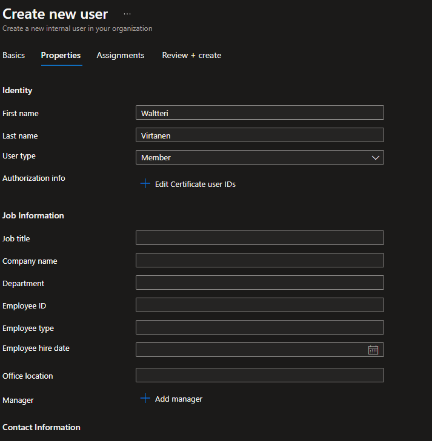
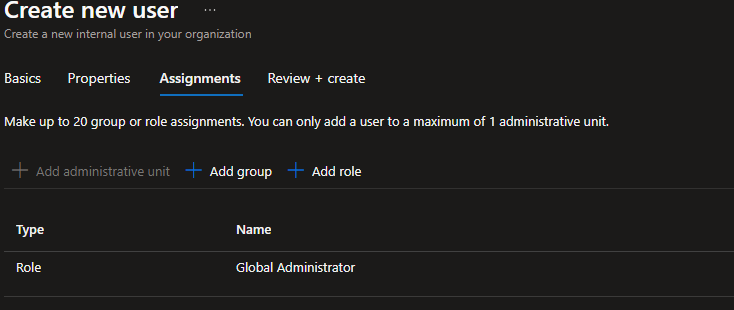

# Page View 

Just normal page view, how it looks like normally (as created and loged inside)

  * [add user](#add-user)
    * [check the user](#check-the-user)
    * 
- [roles](#roles)
  * [permission types](#permission-types)

## add user

Just example add another user, as create account and give a permissions role level

After created account, it will added to list (all users), if does not first come (REFRESH) the list just in case, but be patiences.
There is small info need to check, as right column (identiifies) under there is two different types.

### check the user

Small warning this user (just normal admin level) DO NOT have any Microsoft licenses

## login

Normally 

# roles

## permissions type

All permission and role types can be found under the link, but global admin (is like super root) and control everything like sharepoint, users data, reset user password, execute/update/delete users or groups, check exchange (emails) logs and ect.
- https://learn.microsoft.com/en-us/microsoft-365/admin/add-users/about-admin-roles?view=o365-worldwide

hmm.. small surpised even created new user (another member) without any roles can logged to admin center `admin.microsoft.com`, but it can not do any change like update/delete/execute any users just like only view only. But it got allow go to other path websites e.g. azure entra id and ect, but until global admin give an access, then can change something. 

- usually give a <b> principle of least privilege </b> if is new member account, but it is good for practices again.

