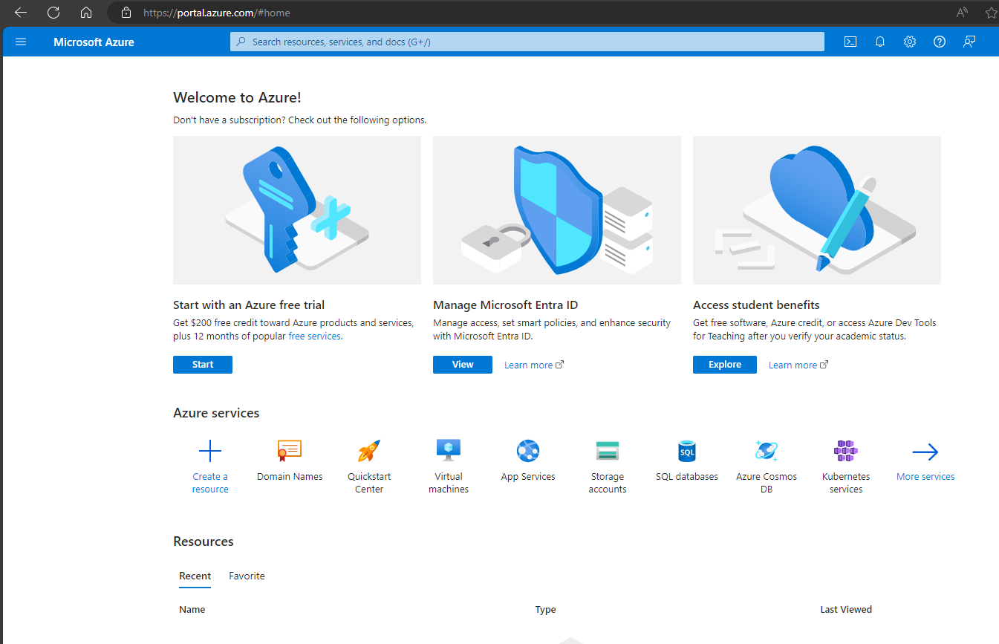
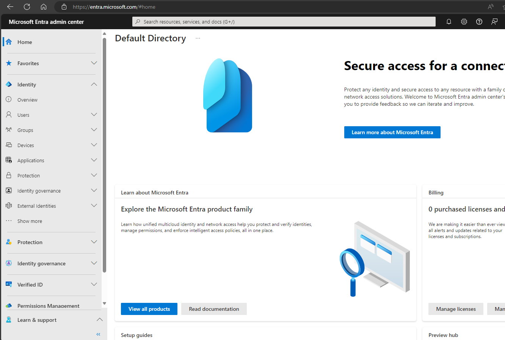
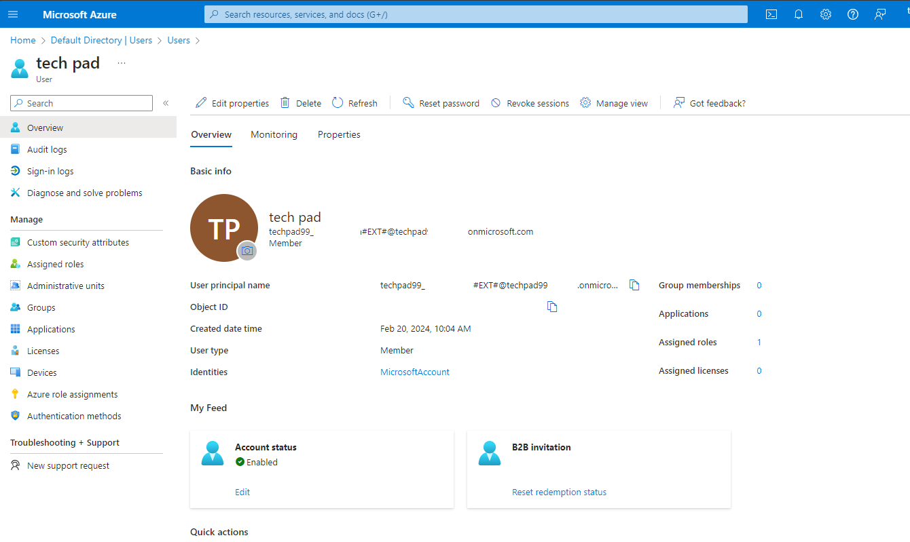
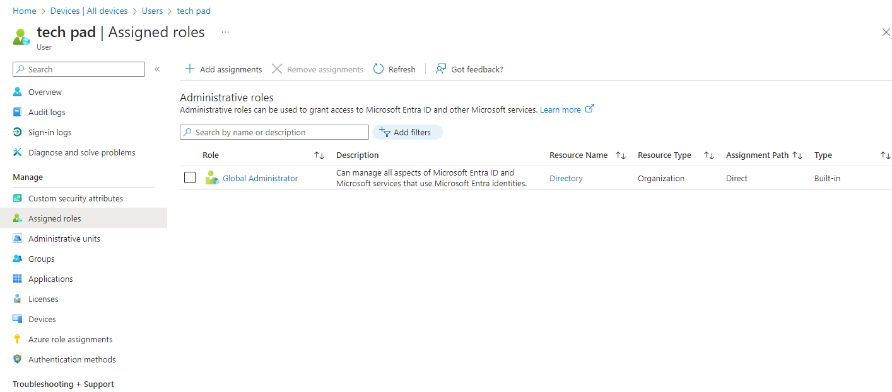
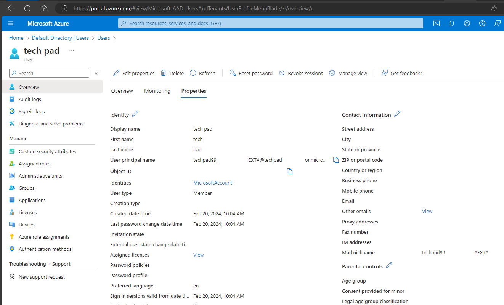
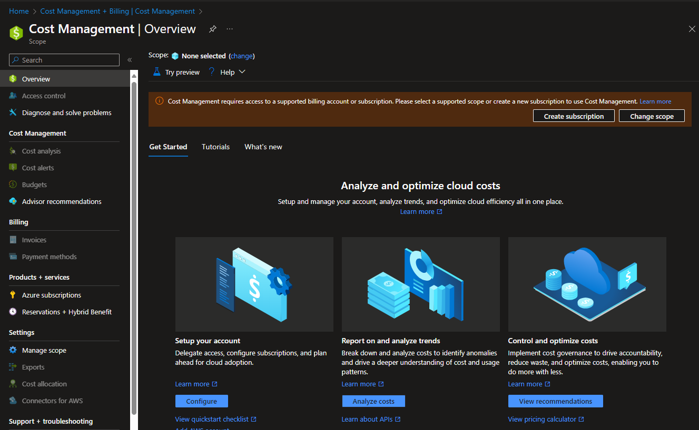

# Own private version

- [Own private version](#own-private-version)
  * [Before login](#before-login)
  * [subscriptions and bills](#subscriptions-and-bills)
  * [lifecycle](#lifecycle)
  * [Small summay](#small-summay)

Well maybe free, but Microsoft had created an Azure free account (websites) for who like practices, interesting about more Azure cloud services, integration, migration, security and data protection, run REST APIs and other cloud services systems. As all known creating an Azure account it's free and receive 12 month (with credit). There is another method similar way get Azure cloud environment. 

Normally if is company admin(s) or receive companies admin roles/levels permissions, then is accessfully sort of permissions path go to these path of the websites and tools `admin.micosoft.com` , `azure.portal.com`. If webpage is not working or other reason it might be need licenses, or permissions or subscriptions or other troublehsoots. Anyway creating an Azure account it's still free for 12month and give a free credit values to user. Latest information Feb 2024.

- For "freelancer" or who continues practices with microsoft services like own environment, just go to this webpage; `entra.microsoft.com` (it is like azure ad / admin center, but this type might be for free and the idea is like small company azure user identity and access management environment)

entra id is working as identify/same as other services tools like `aad.portal.azure.com` / azure portal `portal.azure.com`
so.. where this account go and what url path this offers likes;
- `portal.azure.com`
- `entra.microsoft.com` == (same as) `aad.portal.azure.com` == `intuneeducation.portal.azure.com`
- `admin.microsoft.com` (well tried, so no work..) 
- `intune.microsoft.com` (MDM)
- check email, write word, powerpoint and excel sheets just browser version, if need desktop (buy a licenses..)

Extra tools where if user got "global admin" role as permission then is available go these path; 
- `security.microsoft` , `admin.microsoft.com`
- `myaccount.microsoft.com` - this path is like organization internal path, where user can check own my account settings, devices if got connection, security info as (phone number and mfa app is available) and others manage settings.

Because at least there need another account for who can got access like (Global admin - Can manage all aspects of Microsoft Entra ID and Microsoft services that use Microsoft Entra identities.) Of course can be few (more than one got this permission levels)

Other links;
`admin.microsoft.com/servicestatus` , `connectivity.office.com/status` , 

## Before login 

Before login, there need to be a real microsoft account (private account might be fine), just login with it. Is like own email account what will receive <b> free default settings and licenses </b> using by Teams, Outlook, Word, powershell, excel application and onedrive 5Gb (cloud storage). But currenlty at Windows desktop support Microsoft accounts like can use it as Outlook (new) desktop app and Teams app. Small new is a can receive free Azure Cloud server by using License Microsoft Entra ID Free version.

At "Default directory | overview" --> Manage tenants --> got this same account when logged in `<nicknameDomain>@hotmail.com`
but domain name is: `<nicknameDomain>.onmicrosoft.com`

If want to create another tenant as create new company will be give a good name (such a new company and new tenant), and the configuration at end will be `<domainName>.onmicrosoft.com`

of course can another domain names, under "manager/custom domain names", but if add another domain name configuration will happening at "manage tenants" (let's not focusing that, im not creating company name, "techpad" is fine).

this account "techpad99" is as global administrator role as super root / admininistrator.

if this site got multiple user or few users, so.. there is might be no problem if create another user. But creating user will coming user principal name (like email account) as login username, "NAME@USERDOMAINNAME.onmicrosoft.com"

https://www.microsoft.com/en-us/security/business/microsoft-entra-pricing

where need subscriptions, using portal.azure.com bash or powershell command line, or other resources like vm, creating other resources more database storage, devops, logic app, automation, windows server 2019, ubuntu, red hat and ect. getting more services and marketplaces tools like more practicing.

 

## subscriptions and bills

Subscriptions and bills are almost important, does there will be coming any bills or ect? So there can check by search "cost management" or under the "subscriptions". Well an Azure account is free for user 12month, but the Microsoft more plus few credits for user that's why need a real credit card (number).

If add subscriptions like creating new vm (virtual machine), testing virtual environment, load balance, need more data storage spaces, security and ect integration and migration, firewall, vpn and other testing systems, then it will cost something huge value. For example Azure offer PaaS (platform as a service) systems and give an cloud server infrastructures. 

But after added subscriptions credit card can check the calculate and how much it cost and usually give a 0.XY/h dollar/euro..

## lifecycle

For who will like practice or as freelancer or who is interesting about Azure Cloud service systems as IT guy, so if <b>do not upgrade/update </b> Azure subscription or the account (in 30 days) or as the credit will end (well hard to say which one come to first..) but anyway it will automatically shut down. If want to continue with Azure cloud it must be upgrade the account. 

Normally as Azure (Microosft) say it's free using it 12 month (1 year). So if upgrade the account it will carry on (maybe) just that 12 month (try version) just cutting and losing free version. Microsft will send to user email notification about time to update/upgrade enterprise credit.

`https://learn.microsoft.com/en-us/azure/cost-management-billing/manage/avoid-charges-free-account`

<h>

## Small summay

Small result it can login basic azure (free version), entra id (former name, active directory) web page.

well, this first account `(@hotmail.com)` was created about.. at Novermber-Decembet 2023, but just for testing Windows/Microsoft hardware account, if is joining to this site as start using these tools of the pages `portal.azure.com` and "entra.microsoft.com" it's started today 20.2.2024 (let's see what happening later (30 days) later..)
